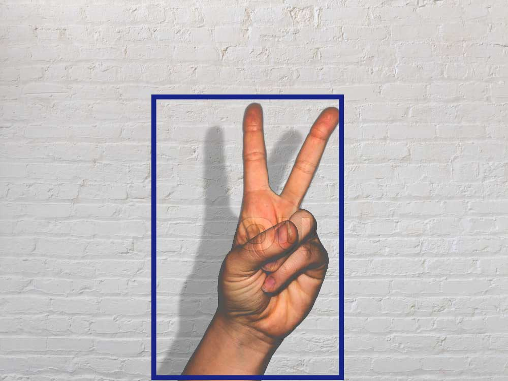

# Motion-detector
This is a real time motion detection app that will detect any type of motion during a real time video and will also plot the graph for the same with the time of entering and leaving of the object in the field of camera.

## How to use
Use the package manager [pip](https://pip.pypa.io/en/stable/) to install opencv,pandas and bokeh.
```bash
pip install bokeh
```
```bash
pip install pandas
```
```bash
pip install opencv-python
```

Start your app using
```bash
python motion.py
```

## Screenshot
* No motion


* Motion

